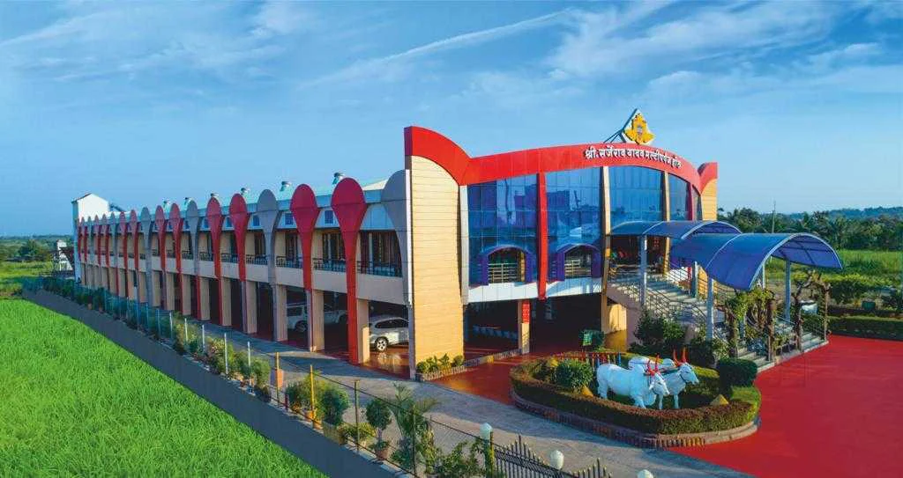

# 🏛️ Hall Booking Portal

A modern, responsive web application for booking halls and lawns for events like weddings, parties, and corporate functions. Built with a premium dark theme featuring glassmorphism design principles.



---

## ✨ Features

### 🏠 Core Functionality
- **Hall Listings** - Browse multiple venue options with detailed information
- **Interactive Calendar** - Visual availability calendar with color-coded statuses
- **Slot-Based Booking** - Morning, Evening, and Night slots available
- **Real-time Availability** - Live updates from database preventing double bookings
- **My Bookings** - View and manage your reservations with cancellation option

### 💳 Payment Integration
- **Razorpay Payment Gateway** - Secure online payments
- **Payment Verification** - Automatic booking confirmation after successful payment
- **Booking ID Generation** - Unique identifiers for each reservation

### 🎨 UI/UX
- **Premium Dark Theme** - Navy blue and gold color scheme
- **Glassmorphism Design** - Modern glass-effect cards and panels
- **Responsive Layout** - Works seamlessly on desktop and mobile devices
- **Smooth Animations** - Fade-in effects and transitions
- **Interactive Elements** - Hover effects and dynamic content loading

---

## 🛠️ Technology Stack

### Frontend
| Technology | Purpose |
|------------|---------|
| **HTML5** | Structure and semantic markup |
| **CSS3** | Styling with CSS variables, Flexbox, Grid |
| **JavaScript (ES6+)** | Client-side interactivity and logic |
| **Font Awesome 6.4.0** | Icons and visual elements |
| **Google Fonts** | Typography (Inter, Playfair Display) |

### Backend/Database
| Technology | Purpose |
|------------|---------|
| **Supabase** | Backend-as-a-Service (BaaS) for database |
| **PostgreSQL** | Database (via Supabase) |
| **PHP** | Server configuration (XAMPP) |

### Payment Gateway
| Technology | Purpose |
|------------|---------|
| **Razorpay** | Payment processing and checkout |

### Development Environment
| Technology | Purpose |
|------------|---------|
| **XAMPP** | Local development server (Apache + PHP) |

---

## 📁 Project Structure

```
hall2/
├── index.html          # Main entry point / Home page
├── success.html        # Payment success confirmation page
├── style.css           # Main stylesheet with all styling
├── script.js           # Main JavaScript file with all logic
├── config.php          # Razorpay API configuration
├── README.md           # Project documentation
│
├── 📷 Images
│   ├── hero.png        # Hero section background
│   ├── upi_qr.png      # UPI QR code for payments
│   ├── hall1.jpg       # Hall 1 primary image
│   ├── hall11.jpg      # Hall 1 gallery image
│   ├── hall111.jpg     # Hall 1 gallery image
│   ├── hall2.jpg       # Hall 2 primary image
│   ├── hall22.jpg      # Hall 2 gallery image
│   ├── hall222.jpg     # Hall 2 gallery image
│   ├── hall3.jpg       # Hall 3 primary image
│   ├── hall33.jpg      # Hall 3 gallery image
│   ├── hall333.jpg     # Hall 3 gallery image
│   ├── hall4.jpg       # Hall 4 primary image
│   ├── hall44.jpg      # Hall 4 gallery image
│   ├── hall444.jpg     # Hall 4 gallery image
│   └── hall_extra.jpg  # Additional hall image
```

---

## 🚀 Getting Started

### Prerequisites
- **XAMPP** (or any local PHP server)
- **Web Browser** (Chrome, Firefox, Edge recommended)
- **Internet Connection** (for Supabase and Razorpay)

### Installation

1. **Clone/Download** the project to your XAMPP htdocs folder:
   ```bash
   cd C:\xampp\htdocs
   # Place the 'hall2' folder here
   ```

2. **Start XAMPP Services**:
   - Open XAMPP Control Panel
   - Start **Apache** server

3. **Access the Application**:
   ```
   http://localhost/hall2/
   ```

---

## 📦 External Dependencies (CDN)

```html
<!-- Supabase JS SDK -->
<script src="https://cdn.jsdelivr.net/npm/@supabase/supabase-js@2"></script>

<!-- Razorpay Checkout -->
<script src="https://checkout.razorpay.com/v1/checkout.js"></script>

<!-- Font Awesome -->
<link rel="stylesheet" href="https://cdnjs.cloudflare.com/ajax/libs/font-awesome/6.4.0/css/all.min.css">

<!-- Google Fonts -->
<link href="https://fonts.googleapis.com/css2?family=Inter:wght@300;400;500;600&family=Playfair+Display:ital,wght@0,400;0,600;0,700;1,400&display=swap" rel="stylesheet">
```

---

## 🗄️ Database Schema

### Supabase Table: `bookings`

| Column | Type | Description |
|--------|------|-------------|
| `id` | integer (PK) | Auto-generated unique ID |
| `hall_id` | integer | Reference to hall (1-4) |
| `booking_date` | date | Date of booking (YYYY-MM-DD) |
| `slot` | text | Time slot (Morning/Evening/Night) |
| `customer_name` | text | Customer's full name |
| `contact_number` | text | 10-digit mobile number |
| `status` | text | Booking status (Confirmed) |

---

## 🎨 Design System

### Color Palette

| Variable | Color | Usage |
|----------|-------|-------|
| `--primary` | `#D4AF37` (Gold) | Accent color, buttons, highlights |
| `--secondary` | `#0A192F` (Navy Blue) | Main background |
| `--secondary-light` | `#172A45` | Card backgrounds |
| `--text-light` | `#E6F1FF` | Primary text |
| `--text-muted` | `#8892B0` | Secondary text |

### Typography

- **Headings**: Playfair Display (serif)
- **Body Text**: Inter (sans-serif)

---

## 🏛️ Available Venues

1. **Sarjerao Yadav Multipurpose Hall & Lawn**
   - Capacity: 500 Guests
   - Price: ₹70,000/Day

2. **Indira Palace & Lawns**
   - Capacity: 600 Guests
   - Price: ₹90,000/Day

3. **Mankeshwar Multi-purpose Hall & Lawns**
   - Capacity: 500 Guests
   - Price: ₹50,000/Day

4. **Akshay Multipurpose Hall**
   - Capacity: 800 Guests
   - Price: ₹65,000/Day

---

## 🔧 Configuration

### Supabase Setup
Update the credentials in `script.js` and `success.html`:
```javascript
const SUPABASE_URL = 'your-supabase-url';
const SUPABASE_KEY = 'your-supabase-anon-key';
```

### Razorpay Setup
Update the payment link in `script.js`:
```javascript
window.location.href = "your-razorpay-payment-link";
```

Update API credentials in `config.php`:
```php
define('RAZORPAY_KEY_ID', 'your_key_id');
define('RAZORPAY_KEY_SECRET', 'your_key_secret');
```

---

## 📱 Browser Support

- ✅ Google Chrome (recommended)
- ✅ Mozilla Firefox
- ✅ Microsoft Edge
- ✅ Safari
- ✅ Mobile Browsers (responsive design)

---

## 📞 Support

- **Phone**: +91 8010253647
- **Email**: vaishnavipatil1459@gmail.com

---

## 📄 License

This project is for educational and portfolio purposes.

---

## 🙏 Acknowledgments

- [Supabase](https://supabase.com/) - Backend as a Service
- [Razorpay](https://razorpay.com/) - Payment Gateway
- [Font Awesome](https://fontawesome.com/) - Icons
- [Google Fonts](https://fonts.google.com/) - Typography

---

Made with ❤️ for seamless hall booking experiences.
